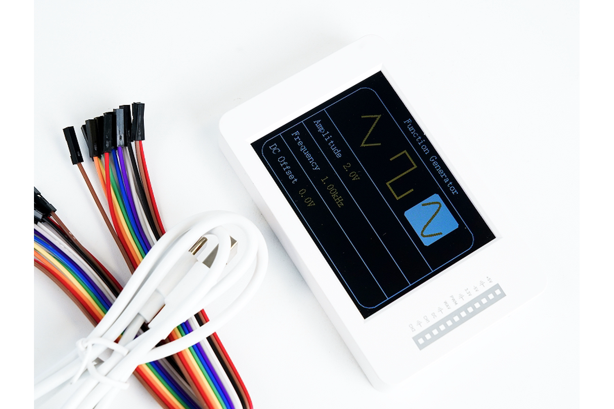

Merlin Sparrow Plus Multi-functional Hardware Debugging Assistant for Oscilloscopes and Spectrum Analyzers is a DIY electronics debugging platform intended to bring oscilloscope and spectrum-analysis workflows into a single compact project for electronics development, learning, and bench-side troubleshooting.

* **Instrument modes:** Oscilloscope and spectrum-analysis functions
* **Development resources:** Documentation, examples, project templates, hardware references, PC-side software, and image assets are organized under the repository directories described below.

## Why Merlin Sparrow Plus Multi-functional Hardware Debugging Assistant for Oscilloscopes and Spectrum Analyzers

Embedded development often reaches a point where firmware logs are no longer enough. A GPIO may be toggling, but at the wrong frequency; a PWM signal may have the wrong duty cycle; an analog sensor may be noisy; a power rail may contain periodic interference; or a circuit may behave differently after an external load is connected. These problems require visibility into the electrical signal itself rather than another line of debug output. Merlin Sparrow Plus is intended to provide that visibility in a DIY platform whose hardware, firmware, and supporting project files can be studied together instead of treating the instrument as a completely opaque appliance.

There is a practical gap between a minimal microcontroller-based waveform demo and a full laboratory oscilloscope or spectrum analyzer. Small demonstration boards are useful for teaching ADCs and plotting samples, but they often leave the user to design the analog input network, display interface, controls, protection circuitry, and firmware architecture. At the other end of the spectrum, professional bench instruments provide calibrated performance, extensive triggering, deep acquisition memory, isolation accessories, automated measurements, and documented safety ratings, but they are not designed primarily as an embedded-development learning platform. Merlin Sparrow Plus is intended for the middle ground: developers who want a usable debugging instrument while still being able to understand and modify the underlying project.


This project should not be treated as a substitute for a calibrated laboratory instrument when measurement traceability, specified uncertainty, high-voltage isolation, compliance testing, or safety-category ratings are required. It should also not be connected directly to mains wiring, high-energy power electronics, RF transmitters, or signals outside the documented input limits unless the hardware documentation explicitly supports that use and the required isolation or attenuation is provided. Users whose work depends on guaranteed trigger performance, deep memory, very high bandwidth, differential isolation, or calibrated amplitude accuracy should compare those requirements with the verified specifications before choosing this platform. The goal of this repository is therefore not to hide limitations, but to make the supported operating conditions and implementation details increasingly explicit as the hardware documentation is committed.

## Quick Start

The first-use workflow is intentionally conservative because several electrical and software details still require confirmation from the product metadata and hardware documentation. Do not guess the input range, programming connector, or power requirements from board appearance alone. Start by verifying the board revision printed on your hardware and comparing it with the documentation in [`docs/`](docs/). If the shipped hardware differs from the photographs or diagrams in this repository, stop before connecting a signal and open an issue with a clear photo of the revision marking. Once the board is powered correctly, use the simplest available example before experimenting with the oscilloscope input.

### 1. Connect USB and Power

1. Remove the Merlin Sparrow Plus hardware and accessories from the package and inspect the PCB, enclosure, connectors, and supplied cables for visible damage. Do not apply power if a connector is bent, the PCB is cracked, a conductive object is trapped underneath the board, or the supplied accessories do not match the package documentation.
5. Leave all measurement inputs disconnected during the first boot. This removes the external circuit as a variable and makes it easier to distinguish a power, firmware, or board-level problem from an input-signal problem.


### 2. Install the Toolchain or IDE

The primary development toolchain, setup procedure, supported programming languages, programmer, debug interface, and configuration-storage method must follow the project documentation rather than assumptions based on the controller family.

5. Select the exact target device and hardware revision documented for Merlin Sparrow Plus rather than a merely similar MCU or generic development board.

> [!IMPORTANT]
> A project can sometimes compile successfully for the wrong target while still using incorrect memory settings, clock configuration, ADC assignments, display pins, or peripheral mappings. Always select the exact device and board configuration documented for your hardware revision.


### 3. Run the First Example

Start with [`examples/led-blink/`](examples/led-blink/) rather than immediately modifying the acquisition or display firmware. A minimal indicator test is useful because it verifies the development environment, board selection, firmware programming path, and basic execution without introducing the analog front end as another source of uncertainty.

1. Open the `examples/led-blink/` project using the documented toolchain.


### Troubleshooting First Boot


## Board Overview


### Main Controller


### Connectors


### Programmer and Debugger


### User Peripherals


### Expansion Headers


### Power Circuitry


## Hardware Features


The following groups are intentionally separated into processing, onboard I/O, development interfaces, and power because each has different constraints during modification or troubleshooting. Values that affect electrical safety or measurement accuracy are left as TODOs until they can be tied directly to the product metadata or schematic. This avoids turning demonstration behavior into an unsupported specification. When a new hardware revision changes any item below, update the version table and pinout at the same time.

### Main IC


### Onboard I/O


### Expansion and Programming


> [!TIP]
> When adding an external module, check both the pinout and the firmware resource map. A pin that is physically accessible may already be used by the display, acquisition engine, control input, boot circuitry, or another onboard peripheral.

### Power


> [!WARNING]
> Do not infer a safe measurement-input voltage from the board's power-supply voltage or processor logic level. The oscilloscope input limit is determined by the complete analog front end and protection network and must be documented separately.

## Available Versions


| Version name / SKU                                | Main IC                           | Key differentiating specifications                                                                                             | Unique features / compatibility notes                                                             |
| ------------------------------------------------- | --------------------------------- | ------------------------------------------------------------------------------------------------------------------------------ | ------------------------------------------------------------------------------------------------- |

> [!IMPORTANT]
> Select the exact device and board configuration that matches the hardware in front of you. Using firmware for a visually similar revision can produce incorrect pin mappings, ADC configuration, display behavior, calibration data, or memory settings even when the project builds successfully.

## Board Dimensions


| Mechanical item                  | Verified value                                                                                             |
| -------------------------------- | ---------------------------------------------------------------------------------------------------------- |


## Pinout


> [!WARNING]
> The verified logic-voltage tolerance and oscilloscope-input limits were not included in the material available for this draft. Do not connect 5 V logic, negative voltages, mains-referenced signals, or any other external source until the relevant pin and input ratings have been confirmed from the schematic and hardware documentation.


## Applications


### Electronics Education and Coursework


### Embedded-System Signal Debugging

During embedded development, an oscilloscope view is useful for checking whether a clock, PWM output, interrupt line, enable signal, or serial waveform is electrically present and approximately timed as expected. Merlin Sparrow Plus can serve as a secondary debugging instrument for these tasks as long as the signal remains within the documented input range and bandwidth. Protocol decoding should not be implied unless a verified decoder is implemented in the firmware; without one, the instrument can still help inspect edge timing, idle levels, glitches, and periodic activity.

### Frequency-Domain Experiments


### Prototype Bring-Up

A compact instrument can be useful during the first power-up of a prototype when an engineer wants to check clock activity, periodic control signals, sensor outputs, or low-voltage analog behavior without moving repeatedly between workstations. The Merlin Sparrow Plus repository can also keep project-specific measurement notes and examples next to the hardware documentation. It should not replace a calibrated bench instrument when exact rise time, noise floor, amplitude accuracy, or high-speed transient behavior is a design requirement.

### Test Fixtures and Integration Work


### Power-Supply and Switching-Noise Investigation

Within the documented input limits, time-domain and spectrum-oriented views can help identify periodic ripple, switching components, or unexpected modulation on low-voltage prototype rails. This is particularly useful for qualitative comparison before and after a layout, filtering, or firmware change. Do not probe mains-connected primary-side circuitry or high-energy switching nodes directly unless the instrument has an explicitly documented safety rating and the proper isolated measurement accessory is used.

### Audio, Sensors, and Hobbyist Experiments


### Instrument-Firmware Development


## Factory Demo


## Repository Structure

```text
.
├── docs/       Documentation
├── examples/   Self-contained example projects
├── project/    Project files and templates
├── hardware/   Schematic and mechanical references
├── software/   PC-side utilities and drivers
└── images/     Artwork for README and docs
```

`docs/` is the main documentation hub for setup instructions, electrical limits, operating procedures, calibration, pin mapping, safety notes, and deeper explanations of the instrument architecture. Documents in this directory should clearly state which hardware revision and firmware version they describe.

`examples/` contains small, self-contained projects intended to verify one concept or hardware subsystem at a time. Each committed example should include its own README, dependencies, build instructions, expected result, and troubleshooting notes.

`project/` contains the primary project files, board definitions, reusable templates, and toolchain-specific configuration used for Merlin Sparrow Plus development. Generated build artifacts should normally remain outside version control unless a firmware image is intentionally distributed for recovery or testing.

`hardware/` is the source of truth for schematic, PCB, mechanical, connector, BOM, and board-level reference material that can be published. Editable design sources should be distinguished from exported PDFs, manufacturing outputs, and archival revisions.

`software/` contains host-side programs, drivers, firmware-upload helpers, data-conversion tools, and other PC utilities that do not belong to a single embedded example. Every utility should state its supported operating systems, dependencies, version, and expected device connection.

`images/` contains stable image assets used by this README and other documentation. Filenames referenced from documentation should remain stable when possible so that links are not broken by cosmetic image updates.

## Documentation

The repository directories themselves can be linked safely even while the final document filenames are still being prepared.

* [Documentation](docs/)
* [Example projects](examples/)
* [Project files and templates](project/)
* [Hardware references](hardware/)
* [PC-side software and drivers](software/)


> [!NOTE]

> [!NOTE]
> Product imagery in the supplied source set shows an oscilloscope-mode interface with waveform and measurement readouts. Those displayed example values should be treated as demonstration UI content rather than electrical performance limits.

When adding a document, include the applicable hardware revision, document revision, and date near the beginning. Measurement limits and calibration instructions should also identify the environmental or test conditions under which they were verified. This makes it much easier for users and automated documentation tools to distinguish current information from archived values.

## Examples

Examples should stay small enough that a user can identify what each project is testing without reading the complete instrument firmware. A good example starts from a clean checkout, builds with the documented toolchain, lists every required connection, and provides an observable success condition. Examples that modify calibration storage or other persistent configuration must warn the user before doing so. Each example should also state the hardware revision on which it was tested.

* [x] [`led-blink`](examples/led-blink/) — verifies the basic toolchain, programming path, and hardware execution
* [ ] `uart-loopback` — minimal UART on GPIO (coming soon)
* [ ] `display-test` — verifies display initialization, orientation, rendering, and user-visible output
* [ ] `control-input-test` — reports the state of each encoder, key, switch, or other user control
* [ ] `adc-raw-capture` — captures raw converter samples without oscilloscope UI processing
* [ ] `oscilloscope-basic` — minimal waveform acquisition and rendering example
* [ ] `spectrum-basic` — minimal frequency-domain processing example with documented FFT configuration
* [ ] `factory-self-test` — repeatable board-level acceptance test and recovery workflow


> [!TIP]
> Keep instrument examples layered. A raw ADC capture example is easier to debug than a full oscilloscope application, and a standalone FFT example is easier to validate than a complete spectrum-analyzer UI.

## Software Compatibility

The exact operating-system and tool-version matrix has not yet been provided, so compatibility should follow the setup documentation rather than assumptions. The table below is intentionally incomplete until each combination has been tested on real hardware. A platform should not be marked supported merely because the compiler itself runs there; USB drivers, firmware upload, serial access, debugging, and host utilities must also work. Record the exact tested version whenever a new release is validated.

| Platform | Support status                                               | Requirements / known issues                                                               |
| -------- | ------------------------------------------------------------ | ----------------------------------------------------------------------------------------- |


## Package Contents


> [!IMPORTANT]
> Do not assume that a probe, attenuator, cable, or adapter visible in an application photograph is included in the retail package. The package list above should match the current SKU and fulfillment process exactly.

## FAQ

### Measurement and Electrical Use

#### What is the maximum voltage I can connect to the oscilloscope input?


#### What are the oscilloscope bandwidth and sample rate?


#### How many oscilloscope channels are available?


#### What input impedance does the oscilloscope present?


#### Can Merlin Sparrow Plus measure mains voltage directly?

Do not connect it directly to mains wiring unless the official hardware documentation explicitly specifies an appropriate measurement category, isolation architecture, voltage rating, and approved accessories. At present, those safety ratings have not been provided in the material used for this README. For mains-referenced or high-energy circuits, use equipment and probes specifically designed and certified for that environment.

#### Is the spectrum analyzer intended for RF measurements?


#### Why can a frequency-domain display show components that are not actually present?


#### Does Merlin Sparrow Plus provide calibrated measurements?


### Hardware and Connections

#### What MCU or processor does Merlin Sparrow Plus use?


#### What voltage are the GPIO or expansion pins?


#### Where can I find the complete pin mapping?


#### Can I use an SWD, JTAG, or another hardware debugger?


### Firmware and Development

#### Which toolchain should I install?


#### How do I restore the factory firmware?


#### The firmware uploads successfully, but the display is blank. What should I check?


#### Can I add my own oscilloscope or spectrum-processing algorithm?


#### How should I report an inaccurate measurement or acquisition bug?

Include the hardware revision, firmware commit or release, toolchain version, operating system, channel configuration, input settings, and exact reproduction steps. Also describe the signal source and, where possible, provide a comparison against a known reference instrument without exposing unsafe voltages. A screenshot alone is usually not sufficient because acquisition settings and calibration state can materially change the result.

## License


## Contributing

Contributions are welcome once they can be tied to a reproducible hardware and software configuration. For a bug report, include the **Merlin Sparrow Plus hardware revision, firmware commit or release, toolchain version, operating system, programming method, relevant connections, and exact steps needed to reproduce the problem**. Measurement-related reports should also include acquisition settings and a description of the signal source while avoiding unsafe test setups.

Documentation corrections are particularly useful when they clarify connector names, revision differences, setup steps, calibration behavior, or an ambiguous electrical limitation. Small wording corrections can be submitted directly, but changes to electrical ratings should cite the schematic, component documentation, controlled test data, or another authoritative project source rather than observation alone.

New examples should be self-contained, start from a clean checkout, build without unrelated local files, and state the exact toolchain version on which they were tested. Every example should include its own README with wiring requirements, build/programming steps, expected output, and common failure modes. Avoid submitting an example that depends silently on files copied from another example directory.

For hardware changes, open an issue before starting a major schematic or PCB redesign so the electrical goal, compatibility requirements, and affected documentation can be discussed first. Changes to the analog input path, protection network, ADC reference, power circuitry, connector pinout, or calibration system require particular care because they can change both measurement behavior and safety assumptions.

Keep pull requests focused on one logical change whenever possible. Do not combine a hardware redesign, unrelated firmware refactor, image replacement, and documentation rewrite into the same PR. Smaller changes are easier to review, test on multiple board revisions, and revert if a regression is discovered.